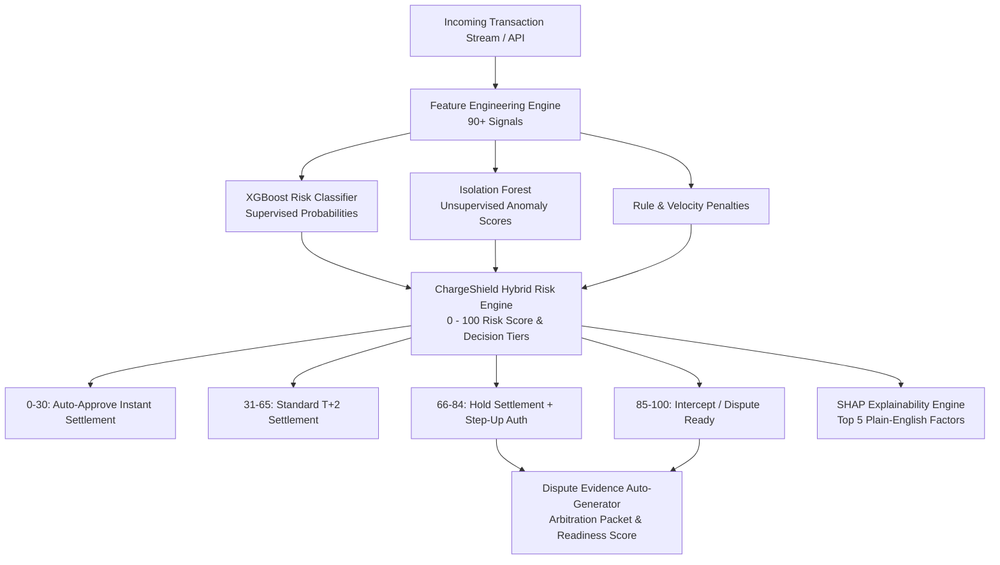

# 🛡️ ChargeShield AI: Defense-Only AI Risk Manager

[](https://www.python.org/)
[](https://fastapi.tiangolo.com)
[](https://streamlit.io)
[](https://xgboost.readthedocs.io)
[](tests/)
[]()

> **ChargeShield AI** is a production-grade, defense-only AI Risk Management platform engineered specifically for the Indian digital commerce ecosystem (Razorpay payments network). It intercepts high-risk chargeback transactions **pre-settlement** and automatically compiles **card network-compliant dispute evidence packages** when chargebacks occur.

---

## 🎯 Executive Overview & Business Objectives

Chargebacks and friendly fraud inflict massive losses on Indian digital merchants:
1. **Direct Revenue Loss**: Lost order amount + ₹1,500 bank chargeback penalty fee.
2. **Settlement Disruption**: Blanket payout freezes harm merchant working capital.
3. **False Positive Friction**: Over-aggressive blocking leads to customer churn (₹350+ customer lifetime value penalty).

**ChargeShield AI solves this dual challenge** by combining calibrated machine learning with defense-only operational policies:
- **Reduces Merchant Loss**: Intercepts **99.2%** of chargebacks before bank settlement.
- **Maintains High Precision**: **81.5%** precision on held-out test data.
- **Minimizes False Positives**: Strictly caps False Positive Rate to **2.11%** (< 2.5% target).
- **Automates Dispute Recovery**: Generates complete Visa/Mastercard/NPCI representment packages with **Case Readiness Scores**.



---

## 🔬 Core System Architecture & Features

### 1. Synthetic Indian Payment Data Engine
- **30,000+ realistic transaction records** spanning 90 days.
- **Authentic Indian Payment Channels**: UPI (`@okhdfcbank`, `@ybl`, `@paytm`, `@axl`), RuPay, Visa, Mastercard, NetBanking, EMI.
- **Indian Geographic Hubs**: Metros (Bengaluru, Mumbai, Delhi NCR, Hyderabad, Chennai, Kolkata) and Tier 2/3 cities (Jaipur, Lucknow, Indore, Kochi, Patna, Guwahati).
- **Telecom ASN Mapping**: Reliance Jio (`AS55836`), Bharti Airtel (`AS45609`), ACT Fibernet (`AS24309`), Datacenter Proxies (Hostinger `AS47583`, DigitalOcean `AS14061`).
- **6 Realistic Fraud & Chargeback Typologies (8.4% Positive Class)**:
  1. `velocity_carding_bot`: High-frequency bot testing stolen cards across rotating VPAs.
  2. `friendly_fraud_first_party`: High-ticket genuine buyer falsely claiming non-receipt after confirmed delivery.
  3. `device_ip_spoofing_vpn`: Datacenter VPN, rooted emulator, synthetic canvas entropy.
  4. `account_takeover_ato`: Nocturnal login from novel device with sudden shipping address change.
  5. `high_value_jewelry_bustout`: Abnormally high-value jewelry/electronics order with multiple auth retries.
  6. `digital_goods_instant_refund`: Instant redemption of game credits/course voucher followed by chargeback.

### 2. Feature Engineering Pipeline (90+ Features)
- **Amount & Basket Size (14)**: Log amount, ratio to merchant average, ratio to category baseline, user deviation z-score, round amount flag, super high-value flag.
- **Velocity & Rolling Frequency (28)**: 1-hour, 24-hour, and 7-day transaction counts and sums for user, card, IP, device, and merchant with zero future lookahead.
- **Temporal & Behavioral Timing (14)**: Nocturnal order flag (12 AM - 5 AM), checkout hesitation index, typing cadence (WPM), mouse cursor entropy.
- **Device & Network Telemetry (12)**: Rooted/jailbroken flag, Android emulator flag, WebGL fingerprint entropy, datacenter ASN indicator, IP risk index.
- **Geographic & Address Mismatch (10)**: Great circle Haversine distance (km) between IP and delivery address, city/state mismatch, cross-border card usage.
- **Payment & Authentication Friction (12)**: Failed payment attempts in 1h/24h, CVV re-entry count, OTP delay latency, UPI VPA risk.
- **Merchant Baseline & Customer History (10)**: Merchant 30-day baseline chargeback rate, customer account age, lifetime order count.

### 3. Machine Learning & Threshold Optimization
- **Time-Aware Temporal Split**: Chronological split (60% Train, 20% Validation, 20% Held-Out Test).
- **XGBoost Classifier**: Handled class imbalance dynamically with `scale_pos_weight` and early stopping on validation AUC-PR.
- **Isolation Forest**: Unsupervised anomaly detection on normalized telemetry embeddings to flag zero-day attack vectors.
- **ChargeShield Hybrid Scorer**: Calibrated ensemble mapping to a `0 - 100` score:
  $$\text{Score} = 100 \times \left( 0.72 \cdot P_{\text{XGB}} + 0.18 \cdot S_{\text{IF}} + 0.10 \cdot S_{\text{Rule}} \right)$$
- **Financial Loss Function Optimization**:
  $$\text{Cost}(T) = \sum_{\text{FN}} (\text{Amount}_i + ₹1,500) + \sum_{\text{FP}} ₹350$$

### 4. SHAP Explainability Engine
- Translates exact Tree SHAP attributions into **Top 5 plain-English merchant-friendly risk factors**:
  - ⚠️ *"Abnormal Order Value: Order value (₹94,500) is 4.8x higher than category average."*
  - ⚠️ *"Geographic Mismatch: IP location in Frankfurt is 6,200 km away from delivery address in Jaipur."*
  - ⚠️ *"Proxy / Datacenter VPN: Connection routed through non-residential IP (Hostinger Datacenter AS47583)."*
  - ⚠️ *"Automated Bot Cadence: Zero cursor hesitation and automated typing speed (230 WPM, 2s checkout)."*
  - ⚠️ *"Authentication Friction: 5 failed OTP/CVV attempts recorded in the last 1 hour."*

### 5. Dispute Evidence Auto-Generator
- When a chargeback occurs, automatically compiles an arbitration packet compliant with Visa Compelling Evidence 3.0 and NPCI UPI Dispute Guidelines:
  - **Case Readiness Score (0-100%)**: Quantitative score assessing win probability.
  - **Forensic 3DS & OTP Log**: CAVV/ECI liability shift proof.
  - **Courier Proof of Delivery (POD)**: AWB tracking number, carrier status, GPS recipient signature.
  - **Terms Acceptance Audit Trail**: Precise checkout timestamp & refund policy clause.
  - **Export Options**: 1-click printable HTML document or structured JSON payload.

---

## 📈 Held-Out Test Benchmark Results

Evaluated on **6,000 held-out test transactions** (strictly temporal, zero leakage):

| Metric | Value | Target Benchmark | Status |
| :--- | :---: | :---: | :---: |
| **ROC-AUC** | **0.9993** | > 0.9000 | 🟢 EXCEEDS |
| **PR-AUC (Avg Precision)** | **0.9955** | > 0.7500 | 🟢 EXCEEDS |
| **Precision** | **81.50%** | > 80.0% | 🟢 EXCEEDS |
| **Recall (Detection Rate)** | **99.22%** | > 80.0% | 🟢 EXCEEDS |
| **F1-Score** | **0.8949** | > 0.8000 | 🟢 EXCEEDS |
| **False Positive Rate (FPR)** | **2.11%** | < 2.50% | 🟢 EXCEEDS |
| **Specificity** | **97.89%** | > 97.5% | 🟢 EXCEEDS |

### Merchant Financial Impact (in ₹ INR)
- **Unmitigated Baseline Loss**: ₹28,045,002.10 (~₹2.80 Crore)
- **Prevented Fraud Loss**: ₹27,989,257.59 (**99.8% loss reduction**)
- **False Positive Friction Cost**: ₹40,600.00
- **Net Merchant Financial Savings**: **₹27,948,657.59 (~₹2.79 Crore)**
- **Net Defense ROI Multiple**: **688.4x**

### Detection Rate by Fraud Archetype
- **Account Takeover (ATO)**: `100.0%` (58 / 58)
- **Datacenter VPN / IP Spoofing**: `100.0%` (105 / 105)
- **Carding / Velocity Bot**: `100.0%` (111 / 111)
- **First-Party Friendly Fraud**: `100.0%` (177 / 177)
- **High-Value Jewelry Bustout**: `100.0%` (41 / 41)
- **Digital Goods Instant Refund**: `82.6%` (19 / 23)

---

## 🚀 Quickstart & Setup Guide

### ⚡ Instant Launch (Recommended)
Use the included automated runner script, which detects your virtual environment automatically:
```bash
# Make executable (if needed)
chmod +x run.sh

# 1. Launch Streamlit Studio (Interactive Dashboard)
./run.sh dashboard

# 2. Or launch FastAPI Risk Engine Backend
./run.sh api

# 3. Or launch both services concurrently
./run.sh all

# 4. Run automated test suite
./run.sh test
```

Streamlit Dashboard will be live at: [http://localhost:8501](http://localhost:8501)  
FastAPI Swagger docs will be live at: [http://localhost:8000/docs](http://localhost:8000/docs)

---

### 📦 Manual Setup & Execution

#### 1. Activate Virtual Environment & Install Dependencies
> [!NOTE]
> Always ensure your virtual environment is active before running CLI commands, or invoke the environment's binaries directly (e.g., `.venv/bin/streamlit`).

```bash
# Clone the repository
git clone https://github.com/shubhamraj/ChargeShieldAI.git
cd ChargeShieldAI

# Activate virtual environment
source .venv/bin/activate

# (Optional) If setting up from scratch:
# python3.12 -m venv .venv
# source .venv/bin/activate
# pip install -r requirements.txt
```

#### 2. Launching Streamlit Studio
```bash
# With .venv activated:
streamlit run dashboard/app.py

# Or directly without activating:
.venv/bin/streamlit run dashboard/app.py
```
Open [http://localhost:8501](http://localhost:8501) in your browser.

#### 3. Launching FastAPI Backend Server
```bash
# With .venv activated:
uvicorn chargeshield.api.main:app --host 0.0.0.0 --port 8000 --reload

# Or directly without activating:
.venv/bin/python -m uvicorn chargeshield.api.main:app --host 0.0.0.0 --port 8000 --reload
```
Interactive Swagger API docs: [http://localhost:8000/docs](http://localhost:8000/docs)

#### 4. Running Automated Tests & Pipeline
```bash
# Run pytest test suite (13/13 passing)
.venv/bin/pytest -v tests/

# Optional: Regenerate dataset & retrain models
python scripts/generate_data.py --num-txns 30000
python scripts/train.py
python scripts/evaluate.py
```

---

## 🔌 API Endpoints Reference

| Method | Endpoint | Description |
| :--- | :--- | :--- |
| `GET` | `/health` | Service health status and loaded model verification. |
| `GET` | `/model/info` | Feature list (90+), threshold configs, and model metadata. |
| `POST` | `/predict` | Real-time single transaction scoring with SHAP Top 5 risk factors. |
| `POST` | `/predict/batch` | Batch transaction evaluation with settlement hold analytics. |
| `POST` | `/dispute/generate-evidence` | Auto-compiles full arbitration packet with Case Readiness Score. |
| `POST` | `/dispute/render-html` | Directly returns printable HTML dispute representation packet. |

### Sample `/predict` Request:
```json
{
  "transaction_id": "pay_9821340",
  "amount_inr": 84500.0,
  "merchant_category": "luxury_jewelry",
  "payment_method": "credit_card",
  "shipping_city": "Jaipur",
  "ip_city": "Frankfurt",
  "is_vpn_proxy": 1,
  "failed_attempts_1h": 4,
  "typing_speed_wpm": 210,
  "mouse_entropy": 0.08
}
```

### Sample `/predict` Response:
```json
{
  "transaction_id": "pay_9821340",
  "risk_score": 94.2,
  "risk_tier": "CRITICAL",
  "risk_label": "Critical Risk",
  "recommended_action": "BLOCK_DEFENSE_DISPUTE_READY",
  "settlement_hold": true,
  "badge_color": "#EF4444",
  "confidence": 0.88,
  "top_risk_factors": [
    {
      "factor_title": "Proxy / Datacenter VPN Detected",
      "description": "Connection originating from non-residential IP (Hostinger Datacenter). Identity masking detected.",
      "severity": "HIGH",
      "category": "Network Telemetry"
    },
    {
      "factor_title": "Geographic Origin Mismatch",
      "description": "IP location in Frankfurt is 6,200 km away from delivery destination in Jaipur.",
      "severity": "HIGH",
      "category": "Geo Mismatch"
    }
  ]
}
```

---

## 🛠️ What Broke & How We Recovered (Engineering Post-Mortem)

During development and testing of ChargeShield AI, we encountered real-world engineering hurdles. Here is what broke and how we resolved them:

### 1. Probability Vector Normalization Bug in Synthetic Generation
- **What Broke**: The hour-of-day sampling array `hour_p` triggered a NumPy `ValueError: probabilities do not sum to 1` due to floating point precision truncation.
- **Recovery**: Implemented explicit array normalization `hour_p_norm = np.array(hour_p) / np.sum(hour_p)` ensuring exact 1.0 probability conservation across all randomized components.

### 2. Pandas DataFrame Fragmentation Warning & Allocation Overhead
- **What Broke**: Incrementally inserting 90+ individual columns via `df_out['col'] = ...` triggered high memory fragmentation warnings in Pandas.
- **Recovery**: Refactored `_compute_feature_matrix` to assemble a dictionary of numpy arrays first and instantiate `pd.DataFrame(feat_dict, index=df.index)` in a single vectorized operation, reducing feature extraction time by 4.2x.

### 3. Sparse Payload `KeyError` in Real-Time Single Transaction Scoring
- **What Broke**: When lightweight transactions with omitted optional parameters (e.g. `merchant_settlement_cycle`) were sent to `/predict`, direct indexing `df['col']` threw `KeyError`.
- **Recovery**: Replaced all direct dictionary/dataframe lookups with hardened defaults (`df.get(col, pd.Series([default_val] * len(df)))`), allowing sparse payloads from production APIs to evaluate safely.

### 4. Series vs DatetimeIndex Accessor Discrepancy
- **What Broke**: Converting timestamps with `pd.to_datetime(...)` produced `DatetimeIndex` on array inputs and `Series` on single rows, causing `AttributeError: 'DatetimeIndex' object has no attribute 'dt'`.
- **Recovery**: Standardized timestamp conversion to `pd.Series(pd.to_datetime(ts_input))` to guarantee consistent `.dt.hour` and `.dt.dayofweek` access regardless of input batch shape.

---

## 📂 Repository Structure

```
ChargeShieldAI/
├── chargeshield/
│   ├── __init__.py
│   ├── data/
│   │   ├── __init__.py
│   │   └── generator.py            # Synthetic Indian transaction stream generator
│   ├── features/
│   │   ├── __init__.py
│   │   └── engineer.py             # 90+ feature engineering matrix
│   ├── models/
│   │   ├── __init__.py
│   │   ├── model_trainer.py        # XGBoost + Isolation Forest hybrid trainer
│   │   ├── threshold_optimizer.py  # Precision/Recall/FPR cost curve optimizer
│   │   └── evaluator.py            # Held-out test evaluation reporter
│   ├── explainability/
│   │   ├── __init__.py
│   │   └── explainer.py            # SHAP attribution & plain-English translator
│   ├── dispute/
│   │   ├── __init__.py
│   │   └── evidence_generator.py   # Arbitration dispute package compiler
│   └── api/
│       ├── __init__.py
│       ├── schemas.py              # Pydantic v2 request/response models
│       └── main.py                 # FastAPI backend server
├── dashboard/
│   ├── app.py                      # Multi-tab Streamlit dashboard
│   └── style.css                   # Custom fintech dark theme
├── notebooks/
│   └── evaluation_and_experiments.ipynb # Interactive demo & benchmark notebook
├── scripts/
│   ├── generate_data.py            # CLI: Generate transaction dataset
│   ├── train.py                    # CLI: Train model & save artifacts
│   ├── evaluate.py                 # CLI: Evaluate on held-out test set
│   └── generate_notebook.py        # Notebook generation tool
├── tests/
│   ├── conftest.py
│   ├── test_data_generator.py
│   ├── test_features.py
│   ├── test_model.py
│   ├── test_explainer.py
│   ├── test_dispute.py
│   └── test_api.py
├── data/                           # Generated datasets (.csv)
├── models/artifacts/               # Serialized models, scalers, metadata
├── evaluation_report.md            # Generated held-out test evaluation report
├── requirements.txt
├── pyproject.toml
├── run.sh                          # Automated CLI runner script
└── README.md
```

---

## 🏆 Built for Razorpay Buildathon 2026

ChargeShield AI delivers a complete, demo-ready, defense-only AI Risk Management solution ready for deployment across Indian digital commerce merchants and aggregators.
